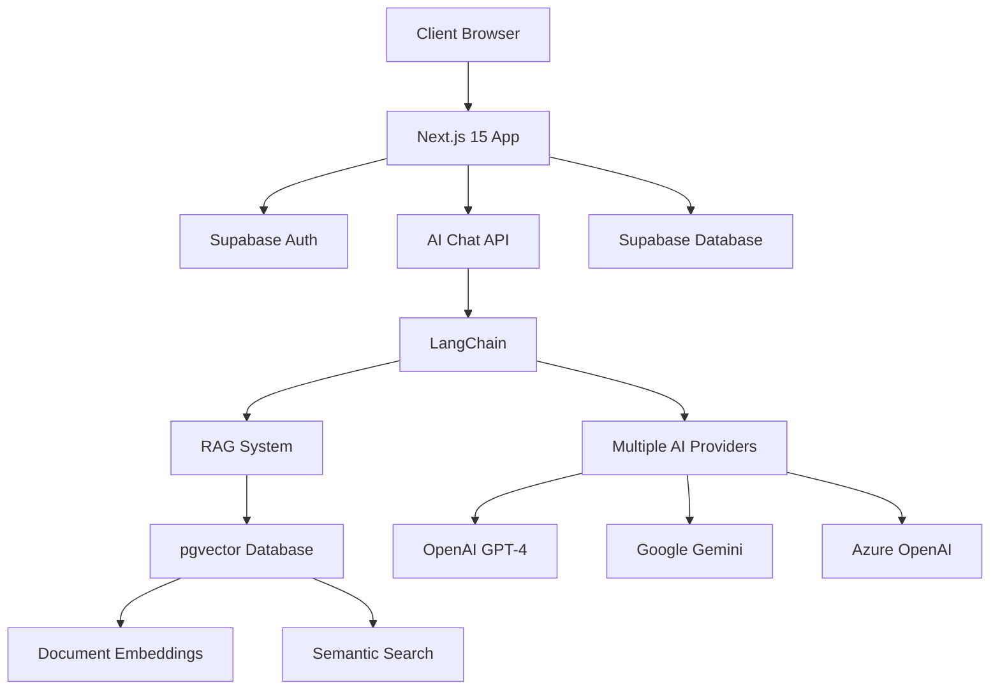

<div align="center">

# 🌿 Wellness AI Assistant

**Professional AI-Powered Customer Support for Wellness & Spa Businesses**

[](https://nextjs.org/)
[](https://www.typescriptlang.org/)
[](https://langchain.com/)
[](https://supabase.com/)
[](https://tailwindcss.com/)

_An intelligent chatbot application built with Next.js 15, LangChain, and Supabase, featuring real-time streaming responses, advanced authentication, and modern React patterns specifically designed for wellness and spa businesses._

[🚀 Deploy to Vercel](https://vercel.com/new/clone?repository-url=https://github.com/Praciller/nextjs-langchain-ai-chatbot) • [📖 Documentation](#-api-endpoints) • [🐛 Report Bug](https://github.com/Praciller/nextjs-langchain-ai-chatbot/issues) • [💡 Request Feature](https://github.com/Praciller/nextjs-langchain-ai-chatbot/issues)

</div>

---

## ✨ Key Features

### 🏢 **Business-Focused Capabilities**

- **🌿 Wellness Industry Expertise**: Specialized AI assistant trained for spa, wellness, and healthcare customer support
- **🎨 Multi-Color Theme System**: Professional green/teal wellness branding with OKLCH color space support
- **📋 Service Information Management**: RAG-powered knowledge base for treatments, pricing, and policies
- **📅 Appointment Assistance**: Intelligent booking support and scheduling guidance
- **💬 Multilingual Support**: Thai and English language support for diverse clientele

### 🚀 **Technical Excellence**

- **⚡ Real-time Streaming Chat**: Built with AI SDK React hooks for seamless user experience
- **🔗 Advanced LangChain Integration**: Sophisticated conversation management and tool calling
- **🔐 Enterprise Authentication**: Complete Supabase-powered login/register/password reset system
- **📊 Smart Session Management**: Optimistic UI updates and intelligent message summarization
- **🎯 Multi-Provider AI Support**: OpenAI, Google AI, Azure, OpenRouter, Ollama, vLLM, and Gradient AI
- **🔍 RAG (Retrieval Augmented Generation)**: PDF/CSV document processing for accurate, context-aware responses
- **📱 Responsive Design**: Seamless experience across desktop and mobile devices

### 🛠️ **Developer Features**

- **🏗️ Modern Architecture**: Next.js 15 App Router with TypeScript and modern React patterns
- **🎨 Shadcn/UI Components**: Beautiful, accessible UI components with Tailwind CSS v4
- **🔒 Protected Routes**: Middleware-based authentication and route protection
- **📈 Performance Optimized**: Token management, connection pooling, and vector search optimization
- **🧩 Modular API Design**: Well-structured endpoints with comprehensive tutorial progression
- **📝 Comprehensive Documentation**: Detailed guides and troubleshooting resources

## 🛠️ Technology Stack

<div align="center">

| Category        | Technologies                                                                                                                                                                                                                              |
| --------------- | ----------------------------------------------------------------------------------------------------------------------------------------------------------------------------------------------------------------------------------------- |
| **Frontend**    |           |
| **UI/Styling**  |    |
| **AI/ML**       |       |
| **Database**    |         |
| **Backend**     |                                                                               |
| **Development** |              |

</div>

### 🏗️ **Architecture Overview**



## 📋 Prerequisites

Before getting started, ensure you have the following installed and configured:

### 🔧 **System Requirements**

- **Node.js 20+** - [Download here](https://nodejs.org/)
- **npm** or **yarn** - Package manager
- **Git** - Version control
- **Modern browser** - Chrome, Firefox, Safari, or Edge

### 🔑 **Required API Keys & Services**

- **OpenAI API Key** - [Get your key](https://platform.openai.com/api-keys)
- **Supabase Account** - [Sign up free](https://supabase.com)
- **Google AI API Key** (Optional) - [Get your key](https://makersuite.google.com/app/apikey)

### ✅ **Verification Commands**

```bash
# Check Node.js and npm versions
node -v  # Should be 20.0.0 or higher
npm -v   # Should be 9.0.0 or higher

# Verify Git installation
git --version

# Optional: Check VS Code
code --version
```

> **💡 Tip**: We recommend using [VS Code](https://code.visualstudio.com/) with the recommended extensions for the best development experience.

## 🚀 Quick Start

### 1️⃣ **Clone the Repository**

```bash
git clone https://github.com/your-username/nextjs-langchain-ai-chatbot.git
cd nextjs-langchain-ai-chatbot
```

### 2️⃣ **Install Dependencies**

```bash
npm install
# or
yarn install
```

### 3️⃣ **Set Up Supabase**

1. Go to [supabase.com](https://supabase.com) and create a new project
2. Choose the region closest to your users (recommended: Southeast Asia - Singapore)
3. Copy your Project URL and API Key from the project settings

### 4️⃣ **Configure Environment Variables**

Create a `.env` file in the root directory (see `.env.example` for reference):

```env
# === Supabase Configuration (Required) ===
NEXT_PUBLIC_SUPABASE_URL=your-supabase-project-url
NEXT_PUBLIC_SUPABASE_PUBLISHABLE_OR_ANON_KEY=your-supabase-anon-key

# === OpenAI Configuration (Required) ===
OPENAI_API_KEY=your-openai-api-key
OPENAI_MODEL_NAME="gpt-4o-mini"

# === Optional: Additional AI Providers ===
GOOGLE_API_KEY=your-google-ai-api-key
GOOGLE_MODEL_NAME="gemini-2.0-flash-exp"
```

### 5️⃣ **Initialize UI Components** (if needed)

```bash
# Initialize Shadcn/UI (if not already done)
npx shadcn@latest init

# Add Supabase Authentication UI components
npx shadcn@latest add https://supabase.com/ui/r/password-based-auth-nextjs.json
```

### 6️⃣ **Start Development Server**

```bash
npm run dev
```

### 7️⃣ **Open Your Browser**

Navigate to [http://localhost:3000](http://localhost:3000) to see your wellness AI assistant in action! 🎉

---

## 📁 Project Structure

```
nextjs-langchain-ai-chatbot/
├── 📁 src/
│   ├── 📁 app/                          # Next.js 15 App Router
│   │   ├── 📁 auth/                     # Authentication pages
│   │   │   ├── 📁 login/                # Login page
│   │   │   ├── 📁 sign-up/              # Registration page
│   │   │   ├── 📁 forgot-password/      # Password reset
│   │   │   └── 📁 confirm/              # Email confirmation
│   │   ├── 📁 api/                      # API endpoints
│   │   │   ├── 📁 chat/                 # Main chat API
│   │   │   ├── 📁 chat_08_rag/          # RAG implementation
│   │   │   └── 📁 document_loader.../   # Document processing
│   │   ├── 📁 chat/                     # Chat interface (protected)
│   │   ├── layout.tsx                   # Root layout
│   │   ├── page.tsx                     # Landing page
│   │   └── globals.css                  # Global styles
│   ├── 📁 components/                   # React components
│   │   ├── 📁 ui/                       # Shadcn/UI components
│   │   ├── 📁 settings/                 # Settings components
│   │   ├── chat-sidebar.tsx             # Chat sidebar
│   │   ├── login-form.tsx               # Authentication forms
│   │   └── model-selector.tsx           # AI model selector
│   ├── 📁 lib/                          # Utility libraries
│   │   ├── client.ts                    # Supabase client
│   │   ├── server.ts                    # Server utilities
│   │   ├── database.ts                  # Database connections
│   │   └── enhanced-theme-provider.tsx  # Theme management
│   ├── 📁 hooks/                        # Custom React hooks
│   ├── 📁 contexts/                     # React contexts
│   ├── 📁 constants/                    # App constants
│   └── middleware.ts                    # Next.js middleware
├── 📁 docs/                             # Documentation
├── 📁 data/                             # Sample data for RAG
│   ├── 📁 pdf/                          # PDF documents
│   └── 📁 text_csv/                     # CSV files
├── 📁 public/                           # Static assets
├── .env.example                         # Environment template
├── components.json                      # Shadcn/UI config
├── next.config.ts                       # Next.js configuration
├── tailwind.config.ts                   # Tailwind CSS config
├── tsconfig.json                        # TypeScript config
└── package.json                         # Dependencies
```

### 🔑 **Key Directories Explained**

- **`/src/app/api/`** - RESTful API endpoints with progressive tutorial structure
- **`/src/components/ui/`** - Reusable Shadcn/UI components with wellness theming
- **`/src/lib/`** - Core utilities including enhanced theme provider and database connections
- **`/docs/`** - Comprehensive documentation and development guides
- **`/data/`** - Sample documents for RAG testing and development

---

## 🔌 API Documentation

### 🔐 **Authentication Endpoints**

| Endpoint                | Method   | Description                               |
| ----------------------- | -------- | ----------------------------------------- |
| `/auth/login`           | GET/POST | User login interface and authentication   |
| `/auth/sign-up`         | GET/POST | User registration with email verification |
| `/auth/forgot-password` | GET/POST | Password reset functionality              |
| `/auth/confirm`         | GET      | Email confirmation handler                |

### 💬 **Chat API Endpoints**

| Endpoint                        | Description             | Features                                   |
| ------------------------------- | ----------------------- | ------------------------------------------ |
| `/api/chat`                     | **Production Chat API** | ✅ Streaming, ✅ History, ✅ RAG, ✅ Tools |
| `/api/chat_08_rag`              | **RAG Implementation**  | Document search, Vector embeddings         |
| `/api/chat_09_rag_tool_calling` | **RAG + Tool Calling**  | Advanced AI with document context          |

### 📄 **Document Processing**

| Endpoint                                              | Purpose                              |
| ----------------------------------------------------- | ------------------------------------ |
| `/api/document_loader_embeding_pgvector/text_csv`     | CSV document processing & embeddings |
| `/api/document_loader_embeding_pgvector/text_csv_pdf` | PDF + CSV processing & embeddings    |

### 📊 **Tutorial Endpoints** (Development Learning)

Progressive learning path from basic to advanced:

1. **`/api/chat_01_start`** - Basic AI model connection
2. **`/api/chat_02_request`** - Request/response handling
3. **`/api/chat_03_template`** - Prompt templates
4. **`/api/chat_04_stream`** - Streaming responses
5. **`/api/chat_05_history`** - Chat history management
6. **`/api/chat_06_history_optimistic`** - Optimistic UI updates
7. **`/api/chat_07_tool_calling_postgres`** - Database tool calling

---

## ⚙️ Configuration

### 🔐 **Environment Variables**

Create a `.env` file in your project root with the following variables:

#### **Required Configuration**

```env
# === Supabase Configuration ===
NEXT_PUBLIC_SUPABASE_URL=https://your-project.supabase.co
NEXT_PUBLIC_SUPABASE_PUBLISHABLE_OR_ANON_KEY=your-anon-key

# === OpenAI Configuration ===
OPENAI_API_KEY=sk-your-openai-api-key
OPENAI_MODEL_NAME="gpt-4o-mini"
OPENAI_EMBEDDING_MODEL_NAME="text-embedding-3-small"
```

#### **Optional AI Providers**

```env
# === Google AI (Gemini) ===
GOOGLE_API_KEY=your-google-ai-key
GOOGLE_MODEL_NAME="gemini-2.0-flash-exp"

# === Azure OpenAI ===
AZURE_OPENAI_API_KEY=your-azure-key
AZURE_OPENAI_API_INSTANCE_NAME=your-instance
AZURE_OPENAI_API_DEPLOYMENT_NAME=your-deployment
AZURE_OPENAI_API_VERSION="2024-02-15-preview"
```

#### **Database Configuration** (for RAG features)

```env
# === PostgreSQL (for RAG + pgvector) ===
PG_HOST=your-postgres-host
PG_PORT=6543
PG_USER=your-postgres-user
PG_PASSWORD=your-postgres-password
PG_DATABASE=postgres
```

### 🎨 **Theme Configuration**

The application includes a sophisticated multi-color theme system:

```typescript
// Available theme colors (OKLCH color space)
const themes = {
  blue: { primary: "oklch(0.6 0.2 240)", secondary: "oklch(0.8 0.1 240)" },
  green: { primary: "oklch(0.6 0.2 140)", secondary: "oklch(0.8 0.1 140)" },
  purple: { primary: "oklch(0.6 0.2 280)", secondary: "oklch(0.8 0.1 280)" },
  orange: { primary: "oklch(0.6 0.2 40)", secondary: "oklch(0.8 0.1 40)" },
};
```

---

## 🚀 Deployment

### **Vercel (Recommended)**

[](https://vercel.com/new/clone?repository-url=https://github.com/Praciller/nextjs-langchain-ai-chatbot)

#### **Step-by-Step Deployment Guide**

1. **Prerequisites**

   - GitHub account with repository access
   - Vercel account (sign up at https://vercel.com)
   - All environment variables ready (see Configuration section)

2. **Deploy to Vercel**

   ```bash
   # Option 1: Using Vercel CLI (Recommended)
   npm i -g vercel
   vercel login
   vercel --prod

   # Option 2: Using Vercel Dashboard
   # Visit https://vercel.com/new
   # Import your GitHub repository
   # Configure environment variables
   # Deploy
   ```

3. **Configure Environment Variables in Vercel**

   Go to your Vercel project → Settings → Environment Variables and add:

   **Required Variables:**

   ```env
   # Supabase
   NEXT_PUBLIC_SUPABASE_URL=your-supabase-url
   NEXT_PUBLIC_SUPABASE_PUBLISHABLE_OR_ANON_KEY=your-supabase-anon-key

   # OpenAI
   OPENAI_API_KEY=your-openai-api-key

   # PostgreSQL (for RAG)
   PG_HOST=your-postgres-host
   PG_PORT=6543
   PG_USER=your-postgres-user
   PG_PASSWORD=your-postgres-password
   PG_DATABASE=postgres
   ```

4. **Configure Supabase for Production**

   After deployment, update your Supabase project settings:

   a. Go to https://supabase.com → Your Project → Authentication → URL Configuration

   b. Add your Vercel production URL to:

   - **Site URL**: `https://your-app.vercel.app`
   - **Redirect URLs**: `https://your-app.vercel.app/**`

   c. Save changes

5. **Verify Deployment**

   Test the following on your production URL:

   - ✅ Home page loads correctly
   - ✅ Login/Register functionality works
   - ✅ Chat interface is accessible
   - ✅ AI responses are streaming correctly
   - ✅ RAG document search works (if configured)

#### **Production URL**

🌐 **Live Application**: [Coming Soon]

### **Other Platforms**

This Next.js application can be deployed on any platform that supports Node.js:

- **Netlify**: Full-stack deployment with serverless functions
- **Railway**: Simple deployment with automatic HTTPS
- **DigitalOcean App Platform**: Managed deployment with scaling
- **AWS Amplify**: Full-stack deployment with CI/CD

### **Docker Deployment**

```dockerfile
FROM node:20-alpine
WORKDIR /app
COPY package*.json ./
RUN npm ci --only=production
COPY . .
RUN npm run build
EXPOSE 3000
CMD ["npm", "start"]
```

### **Deployment Checklist**

- [ ] All environment variables configured
- [ ] Supabase URL configuration updated
- [ ] Database migrations run (if applicable)
- [ ] RAG documents uploaded (if using RAG features)
- [ ] Production testing completed
- [ ] Custom domain configured (optional)

---

## 🤝 Contributing

We welcome contributions to improve the Wellness AI Assistant! Here's how you can help:

### **Development Setup**

1. **Fork the repository** on GitHub
2. **Clone your fork** locally
3. **Create a feature branch**: `git checkout -b feature/amazing-feature`
4. **Install dependencies**: `npm install`
5. **Set up environment**: Copy `.env.example` to `.env` and configure
6. **Start development**: `npm run dev`

### **Contribution Guidelines**

- ✅ **Code Quality**: Follow TypeScript best practices and ESLint rules
- ✅ **Testing**: Add tests for new features and bug fixes
- ✅ **Documentation**: Update README and docs for any changes
- ✅ **Commit Messages**: Use conventional commit format
- ✅ **Pull Requests**: Provide clear description and link related issues

### **Available Scripts**

```bash
npm run dev      # Start development server
npm run build    # Build for production
npm run start    # Start production server
npm run lint     # Run ESLint
npm run type-check # Run TypeScript checks
```

---

## 📚 Learning Resources

### **Official Documentation**

- [Next.js Documentation](https://nextjs.org/docs) - Learn about Next.js features and API
- [LangChain Documentation](https://langchain.com/docs) - Comprehensive guide to LangChain
- [Supabase Documentation](https://supabase.com/docs) - Database and authentication setup
- [Shadcn/UI Documentation](https://ui.shadcn.com/) - UI component library

### **Development Guides**

- [📖 Development Logs](./docs/) - Daily development notes and progress
- [🎨 Theme System Guide](./docs/ENHANCED_THEME_SYSTEM.md) - Multi-color theme implementation
- [🔧 RAG Troubleshooting](./docs/RAG_TROUBLESHOOTING.md) - Common issues and solutions

---

## 📄 License

This project is licensed under the **MIT License** - see the [LICENSE](LICENSE) file for details.

```
MIT License

Copyright (c) 2024 Wellness AI Assistant

Permission is hereby granted, free of charge, to any person obtaining a copy
of this software and associated documentation files (the "Software"), to deal
in the Software without restriction, including without limitation the rights
to use, copy, modify, merge, publish, distribute, sublicense, and/or sell
copies of the Software, and to permit persons to whom the Software is
furnished to do so, subject to the following conditions:

The above copyright notice and this permission notice shall be included in all
copies or substantial portions of the Software.
```

---

## 🆘 Support & Community

### **Getting Help**

- 📖 **Documentation**: Check our [comprehensive docs](./docs/) first
- 🐛 **Bug Reports**: [Create an issue](../../issues/new?template=bug_report.md)
- 💡 **Feature Requests**: [Request a feature](../../issues/new?template=feature_request.md)
- 💬 **Discussions**: [Join our discussions](../../discussions)

### **Community**

- ⭐ **Star this repo** if you find it helpful!
- 🍴 **Fork and contribute** to make it even better
- 📢 **Share with others** who might benefit from this project

---

<div align="center">

**Built with ❤️ for the Wellness Industry**

_Empowering spa and wellness businesses with intelligent AI assistance_

[⬆️ Back to Top](#-wellness-ai-assistant)

</div>
