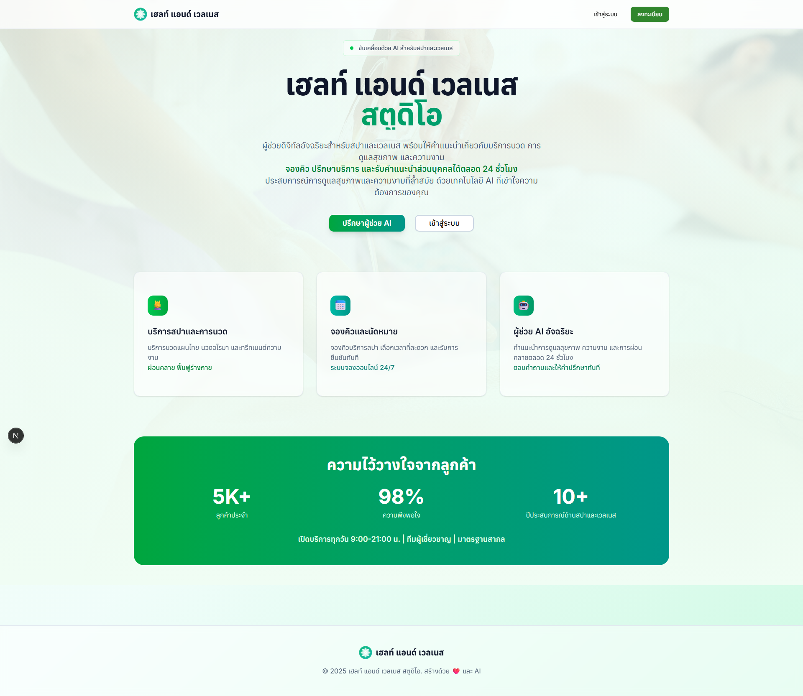
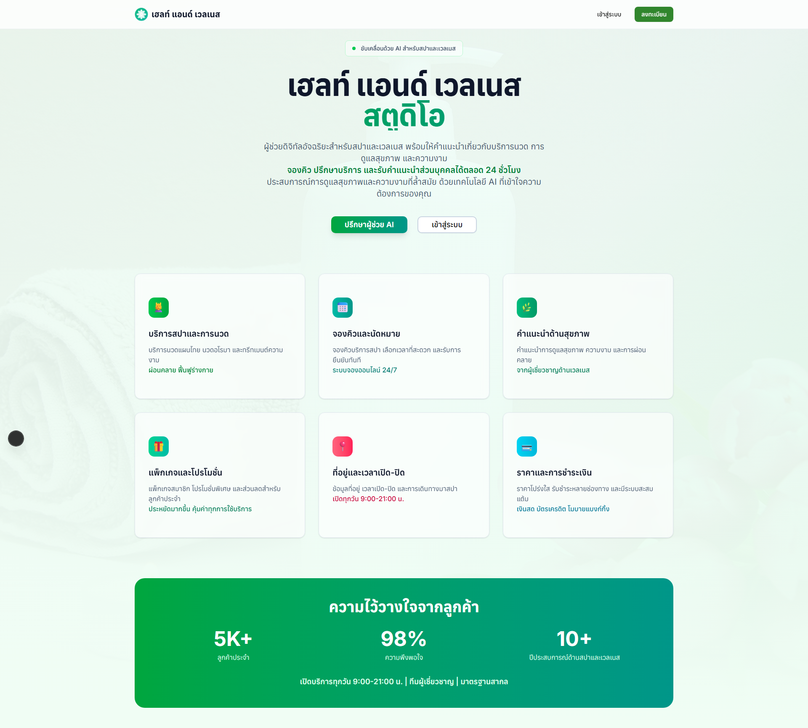

# Wellness AI Assistant

Production-style RAG chatbot for wellness and spa customer support. The project demonstrates how to turn documents, service information, and chat history into grounded AI answers with authentication, vector retrieval, streaming UX, and provider-flexible model integration.

## Preview





## Role Fit

| Target role | Evidence shown in this repo |
| --- | --- |
| AI Engineer | RAG pipeline, LLM orchestration, tool-calling patterns, prompt design, streaming chat |
| GenAI Engineer | LangChain, OpenAI/Gemini support, multi-provider model configuration, document-grounded answers |
| Full-Stack AI Engineer | Next.js App Router, Supabase Auth, PostgreSQL/pgvector, protected routes, production UI |
| Data Engineer | Document ingestion, chunking, embeddings, vector storage, retrieval flow, database integration |

## AI Problem Solved

Customer support teams need fast answers that stay grounded in business-specific policies, services, pricing, and documents. This app retrieves relevant knowledge from uploaded PDF/CSV/text sources and uses an LLM to produce contextual answers in a chat interface.

## Architecture

```text
User question
  -> Next.js chat UI
  -> Protected API route
  -> LangChain orchestration
  -> Query embedding
  -> Supabase PostgreSQL + pgvector retrieval
  -> Retrieved context + prompt template
  -> LLM response stream
  -> Persisted chat/session state
```

## AI and Data Flow

- Loads business documents from local data sources.
- Splits documents with `RecursiveCharacterTextSplitter` for retrieval-friendly chunks.
- Creates embeddings and stores them in PostgreSQL with pgvector.
- Retrieves semantically relevant chunks for each user question.
- Streams grounded LLM answers back to the authenticated chat UI.
- Supports multiple providers including OpenAI, Google AI, Azure/OpenRouter-compatible models, Ollama, and vLLM-style local endpoints.

## Key Engineering Highlights

- Authenticated chat experience with Supabase Auth and protected routes.
- RAG endpoints for document loading, embeddings, and context retrieval.
- Streaming responses using AI SDK/LangChain integration.
- Chat history and session management for usable multi-turn workflows.
- Provider abstraction so the app can run with cloud or local LLMs.
- UI built with Next.js 15, React 19, TypeScript, Tailwind CSS, and shadcn/ui patterns.

## Evaluation and Testing

Current verification focuses on app-level behavior and browser flows:

```bash
npm run lint
npm run test
```

Recommended evaluation additions:

- Create a small golden question set for the wellness knowledge base.
- Track retrieval hit quality: relevant chunk found, no unsupported answer, answer cites the intended source.
- Add regression tests for empty retrieval, low-confidence answers, and malformed uploads.
- Log prompt, retrieved chunk IDs, model, latency, and final answer for debugging.

## Tech Stack

| Layer | Tools |
| --- | --- |
| Frontend | Next.js 15, React 19, TypeScript, Tailwind CSS |
| AI | LangChain, AI SDK, OpenAI, Gemini, Ollama/local LLM support |
| Data | Supabase, PostgreSQL, pgvector, document chunks, embeddings |
| Backend | Next.js API routes, Node.js, protected server utilities |
| Quality | ESLint, Playwright |

## Local Setup

```bash
git clone https://github.com/Praciller/nextjs-langchain-ai-chatbot.git
cd nextjs-langchain-ai-chatbot
npm install
```

Create `.env` from `.env.example` and configure at least:

```env
NEXT_PUBLIC_SUPABASE_URL=your_supabase_url
NEXT_PUBLIC_SUPABASE_PUBLISHABLE_OR_ANON_KEY=your_supabase_anon_key
OPENAI_API_KEY=your_openai_key
OPENAI_MODEL_NAME=gpt-4o-mini
```

Run locally:

```bash
npm run dev
```

Open `http://localhost:3000`.

## Deployment

Recommended deployment target: Vercel.

Deployment checklist:

- Add Supabase environment variables.
- Add model provider keys.
- Configure Supabase Auth redirect URLs for the production domain.
- Verify chat, auth, document ingestion, and retrieval endpoints after deployment.

## Why This Repo Matters

This repo is the strongest AI Engineer signal in the portfolio because it combines LLM integration, retrieval, full-stack product delivery, database-backed memory, auth, and practical UX. It is more relevant for AI Engineer and GenAI Engineer roles than a standalone model notebook because it shows a complete applied AI system.

## License

MIT
